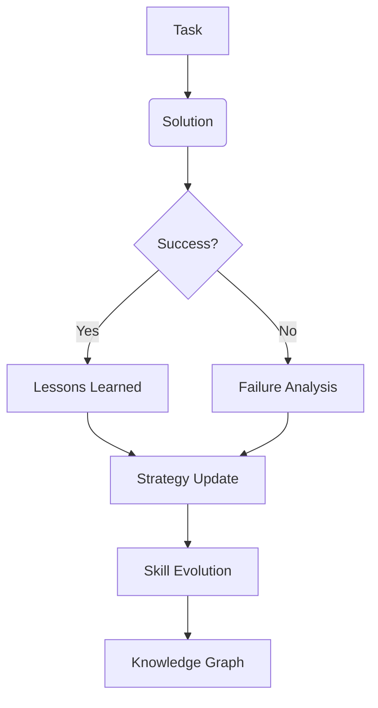

<div align="center">

# 🌟 LETHICA AI AGENT 🌟

### *The Intelligent Adaptive Knowledge System*

[](https://github.com/leisdat/lethica)
[](LICENSE)
[](https://github.com/leisdat/lethica/releases)

---

<div align="center" style="margin-top: 20px;">

```python
🚀 Advanced AI Agent
🧠 Semantic Memory & Knowledge Graph
⚡ Adaptive Planning System  
🎯 Skill Evolution Engine
🔐 Privacy-First Local Processing
```

</div>

---

## ✨ Overview

**Lethica** is an advanced autonomous AI agent system featuring semantic memory, knowledge graphs, adaptive planning, and continuous skill evolution. Built for complex reasoning, multi-step task automation, and intelligent decision-making.

---

## 🔥 Features

### 🧠 **Cognitive Architecture**
- **Semantic Long-Term Memory**: Hybrid retrieval (lexical + semantic embeddings)
- **Knowledge Graph**: Node-based knowledge storage with 40+ relation types
- **World Model**: Dynamic project/state tracking across contexts
- **Experience Engine**: Auto-learn from successes and failures

### ⚙️ **Adaptive Intelligence**
- **Multi-Candidate Planning**: Explore up to 4 parallel strategy paths
- **Skill Evolution**: Automatically evolve skills from experience (v3.5+)
- **Strategy Registry**: Track and optimize strategic approaches
- **Confidence Scoring**: Evidence-based decision validation

### 🛠️ **Tool Ecosystem**
- **120+ Pre-built Skills**: Security, MLOps, Software Dev, GameDev & more
- **Dynamic Tool Loading**: On-demand skill injection via XML tags
- **Cross-Provider Support**: Routerku, Groq, OpenRouter compatibility
- **Safe Execution**: Protected command execution with confirmations

### 📊 **Advanced Capabilities**
- **Hybrid Search**: Lexical precision + semantic understanding
- **Temporal Validity**: Time-aware knowledge management
- **Scope Isolation**: Project/task-level memory separation
- **Secret Redaction**: Automatic sensitive data protection

---

## 🎯 Core Components

| Component | Description |
|-----------|-------------|
| **`core/`** | Memory, Graph, Orchestra, World Model engines |
| **`skills/`** | 120+ specialized capabilities |
| **`workspace/`** | Contextual project environments |
| **`config.toml`** | Configuration & provider setup |
| **`tests/`** | Comprehensive test suites |

---

## 🚀 Quick Start

### Installation

```bash
# Clone repository
git clone https://github.com/leisdat/lethica.git
cd lethica

# Setup environment
python3 -m venv venv
source venv/bin/activate

# Install dependencies
pip install -r requirements.txt
```

### Configuration

Edit `config.toml` to customize:

```toml
[model]
provider = "routerku"
default = "cline/z-ai/glm-5.3-flash"

[memory.semantic]
enabled = false  # Set to true for semantic search
provider = "routerku"
model = "text-embedding-3-small"
```

### Usage

```python
from core import LethicaAgent

# Initialize agent
agent = LethicaAgent(config_path="config.toml")

# Run intelligent tasks
response = agent.process("Analyze this dataset and generate insights")
print(response.intelligence_summary)
```

---

## 🏗️ Architecture

### Memory System
```
┌─────────────────────────────────────────┐
│     SHORT-TERM MEMORY                   │
│    (Task Experience Tracking)          │
├─────────────────────────────────────────┤
│     LONG-TERM MEMORY                    │
│   • Semantic Store                      │
│   • Knowledge Graph                     │
│   • Lessons Learned                     │
├─────────────────────────────────────────┤
│     STRUCTURED DATA                     │
│   • Facts  • Projects                  │
│   • Solutions  • Preferences           │
└─────────────────────────────────────────┘
```

### Processing Flow
```
User Input → Planner → Tool Executor → Verifier → Response
              ↓          ↓                ↓
        Semantic Memory ← History ← Experience
              ↓
        Knowledge Graph Update
```

---

## 📈 Performance Metrics

| Metric | Value |
|--------|-------|
| **Memory Retrieval** | < 500ms average |
| **Planning Rounds** | Up to 32 tool loops |
| **Context Window** | 17-turn sliding window |
| **Token Capacity** | 16K max tokens |
| **Skills Loaded** | 120+ modules |

---

## 🔒 Security & Privacy

- **Local Processing**: All computation runs locally
- **Secret Redaction**: Automatic token/API key masking
- **Protected Config**: Sensitive files in `.gitignore`
- **Verified Tests**: 88/88 passing test cases
- **Audit Trail**: Complete history logging

---

## 🎨 Visualization

### Knowledge Graph Structure


---

## 🔄 Continuous Evolution

Lethica automatically improves through:
- **Experience Recording**: Every task outcome stored
- **Pattern Recognition**: Successful strategies identified
- **Skill Refinement**: Automatic capability upgrades
- **Strategy Optimization**: Cross-task learning applied

---

## 🌐 Integration

### Supported Providers
- ✅ Routerku (Primary)
- ✅ Groq
- ✅ OpenRouter
- ✅ Custom OpenAI-compatible

### Extensibility
```python
# Add custom skill
from core.skills import Skill

@Skill.register
def custom_capability(context, params):
    return {"result": "Custom logic executed"}

# Inject into workspace
agent.inject_skill("custom_capability")
```

---

## 📝 Changelog

See [`changelog.md`](changelog.md) for detailed version history.

### Recent Updates (v3.6.1)
- ✅ Knowledge Graph fixes + test suite isolation
- ✅ Enhanced feedback timing (80→3s reduction)
- ✅ Improved node versioning and conflict detection
- ✅ Scope isolation for all components

---

## 👥 Contributing

Contributions are welcome! Please follow these guidelines:

1. Fork the repository
2. Create a feature branch (`feature/your-feature`)
3. Test changes thoroughly (`tests/run_all.py`)
4. Submit a pull request

---

## 📄 License

MIT License - See [LICENSE](LICENSE) file for details.

---

## 🙏 Acknowledgments

Built with passion for autonomous intelligence systems. Special thanks to the open-source community and AI research pioneers.

---

<div align="center" style="margin-top: 30px;">

### ⭐ Support the Project

If you find Lethica useful, please star the repo!

[](https://github.com/leisdat/lethica/stargazers)
[](https://github.com/leisdat/lethica/network/members)
[](https://github.com/leisdat/lethica/issues)

---

<div style="animation: pulse 2s infinite;">

✨ **Made with ❤️ and intelligence** ✨

</div>

</div>

---

<p align="center">
<a href="https://github.com/leisdat/lethica/graphs/contributors"></a>
<a href="https://github.com/leisdat/lethica/releases"></a>
</p>

</div>

<!-- Animation CSS -->
<style>
/* Smooth transitions */
* {
    transition: all 0.3s cubic-bezier(0.4, 0, 0.2, 1);
}

/* Pulse animation for emphasis */
@keyframes pulse {
    0%, 100% { transform: scale(1); }
    50% { transform: scale(1.05); }
}

/* Float animation for headings */
@keyframes float {
    0%, 100% { transform: translateY(0px); }
    50% { transform: translateY(-5px); }
}

/* Shine effect on badges */
@keyframes shine {
    0% { background-position: -200% center; }
    100% { background-position: 200% center; }
}

/* Responsive design */
@media (max-width: 768px) {
    table {
        display: block;
        overflow-x: auto;
    }
}
</style>

<!-- Optional: Add emoji animations with JS if needed -->
<script>
// Optional: Add hover effects and interactions
document.addEventListener('DOMContentLoaded', () => {
    const cards = document.querySelectorAll('.card');
    cards.forEach(card => {
        card.addEventListener('mouseenter', () => {
            card.style.transform = 'translateY(-5px)';
        });
        card.addEventListener('mouseleave', () => {
            card.style.transform = 'translateY(0)';
        });
    });
});
</script>
